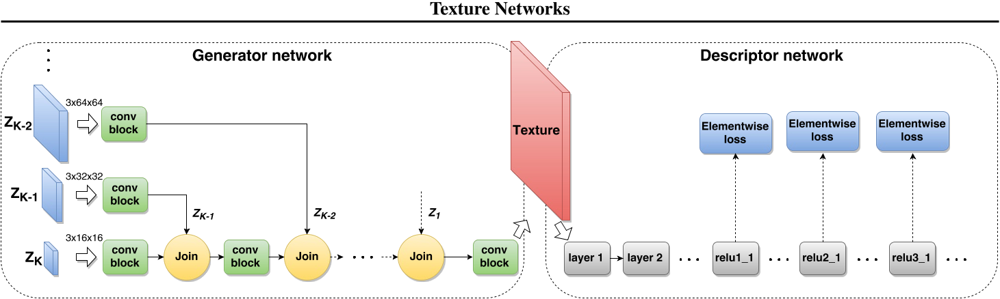

# No.1 Image analogies
[地址](https://readpaper.com/paper/2292976057)

阅读日期：2022/5/19

## notes:

### 文中提到一种类比的观点，通过匹配源图像A与输入图像B的特征，将相应的A'中的特征映射到B'中。并用一个矩阵S记录相对应的位置，其中用到的特征向量来自多个维度（通过将图像进行高斯金字塔分解）。通过ANN来最优化匹配时间。不仅比较相似性，还会比较相邻区域的连贯性。匹配的过程有两种方法，一种利用L2正则化寻找最相似的像素位置，另一种则是寻找连贯性最佳的位置。L2正则化的效果通常不佳，因此对比较距离进行放缩，提出了一个一致性参数k。k越大，一致性越好。同时不同维度上会对k进行放缩。

# No.2 INCORPORATING LONG-RANGE CONSISTENCY INCNN-BASED TEXTURE GENERATION
[地址](https://readpaper.com/pdf-annotate/note?pdfId=4544602532013039617&noteId=679262291878117376)

阅读日期 2022/9/10

## notes:

### 文中提到基于Gram矩阵的的风格损失，无法考虑到长程结构。因此引入了新的空间相关性损失，将目标图像和生成图像的特征图进行水平和垂直平移，水平平移进行向左和向右平移，并计算Gram矩阵，垂直方向同样计算Gram矩阵，最终目标图像和生成图像的Gram矩阵差值当作互相关损失。

# No.3 VERY DEEP CONVOLUTIONAL NETWORKS FOR LARGE-SCALE IMAGE RECOGNITION
[地址](https://readpaper.com/pdf-annotate/note?pdfId=668974607280537600&noteId=731386370667606016)

阅读日期 2022/9/27

## notes:

### 著名的VGG系列网络，在数据集ILSVRC上的图像分类任务所最先提出。
- 文中采用3层3\*3的卷积核替代7\*7的卷积核，以达到相同的感受野，同时减少参数量，并达到将7\*7的卷积核参数进行非线性化分解的目的。
- 在训练时提到了将图像的大小各向同性的放缩到区间：$[S_{min}, S_{max}]$，在放缩后的图像上截取出测试数据大小。
- 在测试时，作者进行了全卷积网络和随机采样的测试方案，同时将两者结合将得到更好的结果。

# No.4 Deep Residual Learning for Image Recognition
[地址](https://readpaper.com/pdf-annotate/note?pdfId=4498400126502068225&noteId=733943178233257984)

阅读日期 2022/10/1

## notes:

### 文中针对随着网络深度的增加，训练误差会出现增加的网络降级问题，提出了一种残差学习思想，假定预期分布为H(x),网络将预期找到分布F(x):=H(x)−x，这种设计可以放大卷积层的扰动，让网络对特征的改变更加敏感。参考[博客链接](https://blog.csdn.net/u014665013/article/details/81985082)

# No.5 Demystifying Neural Style Transfer
[地址](https://readpaper.com/pdf-annotate/note?pdfId=4500179956688117762&noteId=736426343529558016)

阅读日期 2022/10/2

## notes:

### 作者通过公式变换证明了风格迁移中的格拉姆矩阵的实质是在进行某种领域自适应算法，即某种MMD算法。

### kernel function $k(x, y) = \lang φ(x), φ(y) \rang$那么：
$$
MMD^2[X, Y ] = \frac{1}{n^2} \sum_{i=1}^{n} \sum_{i\prime=1}^{n}k(x_i, x_{i\prime} ) + \frac{1}{m^2} \sum_{j=1}^{m} \sum_{j\prime=1}^{m}k(y_j, y_{j\prime} ) - \frac{2}{nm} \sum_{j=1}^{m} \sum_{i=1}^{n}k(x_i, y_j )
$$
### 也就是说Gram矩阵的核函数相当于$k(x, y) = (x^T y)^2$。作者在此处相应提出了几种其他核函数
- ### (1) Linear kernel:$k(x, y) = x^T y$; 
- ### (2) Polynomial kernel: $k(x, y) = (x^T y + c)^d$; 
- ### (3) Gaussian kernel: $k(x, y) = exp( − \frac{\parallel x−y \parallel ^2_2}{2 \sigma ^2} )$.

# No.6 Texture Networks: Feed-forward Synthesis of Textures and Stylized Images

[地址](https://readpaper.com/pdf-annotate/note?pdfId=4667244947913588737&noteId=736463758423314432)

阅读日期 2022/10/3

## notes:

### 文中提到了一种基于Gram矩阵作风格损失的前馈网络生成模型，通过一个分类网络来提取风格图像（参数固定）和生成图像的参数。只进行纹理生成时输入的将是不同尺度的空白噪声，也只会采用风格损失。而在进行风格迁移时，输入的将是空白噪声与内容图像串接的张量（文中未给出示意图），同时也会包含内容损失与风格损失，但当训练图像的样本数较多时，效果会产生退化。作者将其解释为训练用图像可能会包含不同比例不同组合的局部结构，因此很难找到一种局部操作，去匹配风格图像的固定比例的结构。

# No.7 Perceptual Losses for Real-Time Style Transfer and Super-Resolution

[地址](https://readpaper.com/pdf-annotate/note?pdfId=551963422565285888&noteId=679585957359124480)

阅读日期 2022/10/4

## notes:

### 作者基于Gram矩阵做风格损失，应用了一种可用于风格迁移和超分辨率的生成模型，在进行超分辨率时仅仅采用内容损失。生成网络基于ResNet构建，特征提取网络则是基于VGG网络。作者表示风格迁移的图像习惯于保留VGG分类的图像的部分特征，而忽视背景进行纹理替换，即VGG网络中包含的特征即分类物体的特征，因此这些结构能被很好的保留。在训练网络时作者用了约80k的样本图像。同时引入了新的全变分损失。

# No.8 StyTr$^2$:Image Style Transfer with Transformers

[地址](https://readpaper.com/pdf-annotate/note?pdfId=4666401365451358209&noteId=737596590235406336)

阅读日期 2022/10/7

## notes:

### 这篇论文提出了一种基于Transformer的编解码器式风格迁移算法。作者同时改用了参数化位置编码，来替代之前Transformer的PE。同时采用AdaID论文中的风格与内容损失。CAPE（内容敏感位置编码）首先将图像进行平均池化，在进行1X1的卷积作线性转换，再进行上采样就能得到位置编码。图像在进入Transformer之前要先进行编码转换成序列。

# No.9 Stable and Controllable Neural Texture Synthesis and Style Transfer Using Histogram Losses

[地址](https://readpaper.com/pdf-annotate/note?pdfId=4500180024317075457&noteId=679263723566039040)

阅读日期 2022/10/14

## notes:

### Gatys等人的算法中，纹理合成生成的图像可能存在重影，伪影等问题，对特定任务需要适当的参数调节，生成效果随尺度增加也变得更不稳定。作者认为有很多变换会在在不改变Gram矩阵的情况下改变输入纹理的方差等统计分布，因此要进行约束，并提出采用直方图匹配对图像纹理作进一步的约束。
$$L^{(ours)}_{transfer} = L_{gram} + L{histogram} + L{content} + L{tv}$$

# No.10 Laplacian-Steered Neural Style Transfer

[地址](https://readpaper.com/pdf-annotate/note?pdfId=4666727087353118722&noteId=679267299310862336)

阅读日期 2022/10/15 

## notes:

### 作者认为采用高层的特征差异作为内容损失会导致局部结构的转化效果不理想，尤其表现在人脸等人眼比较敏感的图像上。根据Gatys等人的实验，直接采用低层的内容特征作为损失会使图像的风格化受阻。因此本文作者采用了Laplacian损失来确保生成图像能保持较好的局部纹理特征。作者还提出采用不同的池化层，以捕获不同尺度的局部信息。

# No.11 Combining Markov Random Fields and Convolutional Neural Networks for Image Synthesis

[地址](https://readpaper.com/pdf-annotate/note?pdfId=4512514380045901825&noteId=741167555585413120)

阅读日期 2022/10/15

## notes:

### Li 和 Wand  是第一个提出基于 MRF 的 NST 算法的人。他们发现，具有汇总统计的参数 NST 方法仅捕获每像素特征相关性并且不限制空间布局，这导致照片级风格的视觉效果不太可信。他们的解决方案是以非参数方式对样式进行建模，并引入新的样式损失函数，其中包括基于补丁的 MRF ：Li 和 Wand 算法的优势在于，它在照片级风格上表现得特别好，或者更具体地说，当内容照片和风格在形状和透视上相似时，由于基于补丁的 MRF 损失。但是，当内容和风格图像在透视和结构上有很大差异时，它通常会失败，因为图像块无法正确匹配。它在保留清晰的细节和深度信息方面也受到限制。

# No.12 Improved Texture Networks: Maximizing Quality and Diversity in Feed-forward Stylization and Texture Synthesis

[地址](https://readpaper.com/pdf-annotate/note?pdfId=4665121651080314881&noteId=678152556626788352)

阅读日期 2022/10/15 

>To be continued

## notes:

### instance normalisation的提出

# No.13 StyleBank: An Explicit Representation for Neural Image Style Transfer

[地址](https://readpaper.com/pdf-annotate/note?pdfId=4500181140870160385&noteId=679989064580366336)

阅读日期 2022/10/18

## notes:

### 作者提出将图像风格单独作为一种特征进行提取，文中将风格特征提取为一组卷积过滤器，能够通过增量训练进行扩充。他们的网络结构包括两组，一组训练包含了风格过滤器，另一组不包含，让网络能够在不引入风格时较好地完成图像的重建工作，训练策略见下。StyleBank作为卷积操作，当卷积核较大时能捕获更大尺度的纹理特征。作者同时发现特定的风格特征在经过自编码器之后被分配到了特征空间不同维度的特征图上，并呈现出一种稀疏分布。

### 网络结构为：

### 同时作者提出了风格混合的两种策略，其中$w_i$是风格权重，而$M_i$是mask，相当于拼接在一起，只进行一次网络的pass就可以混合。
- > Linear Fusion of Styles.
$$
F = (\sum_{i=1}^m w_i ∗ K_i) \otimes F \qquad \sum_{i=1}^m w_i = 1
$$
- > Region-specific Style Fusion.
$$ 
F = \sum_{i=1}^m K_i \otimes(M_i \times F),
$$

# No.14 A LEARNED REPRESENTATION FOR ARTISTIC STYLE

[地址](https://readpaper.com/pdf-annotate/note?pdfId=4546319332660633601&noteId=679660474198654976)

阅读日期 2022/10/19

## notes:

### 作者基于No.7 Perceptual Losses for Real-Time Style Transfer and Super-Resolution提出了一种能够进行多种风格转换的网络。他们采用了一种conditional instance normalization的方式，$z = \gamma_s ( \frac{ x − \mu}  \sigma )+ \beta_s$

# No.15 Precomputed Real-Time Texture Synthesis with Markovian Generative Adversarial Networks

[地址](https://readpaper.com/pdf-annotate/note?pdfId=4500175422989426689&noteId=679650995239387136)

阅读日期 2022/11/12

## notes:

### 作者认为前者使用高斯分布来估计图像的纹理特征存在缺陷，基于马尔可夫随机场作对抗生成网络。他们发现某些平滑的区域，譬如天空，或者是缺少VGG网络关注的区域会产生比较差的结果。由于进行比对时，这些区域的激活无法被VGG网络有效捕捉。

